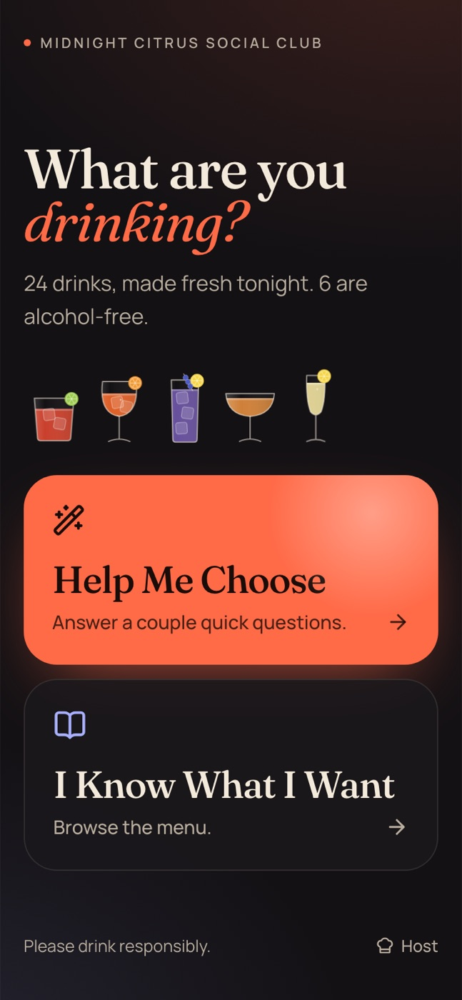
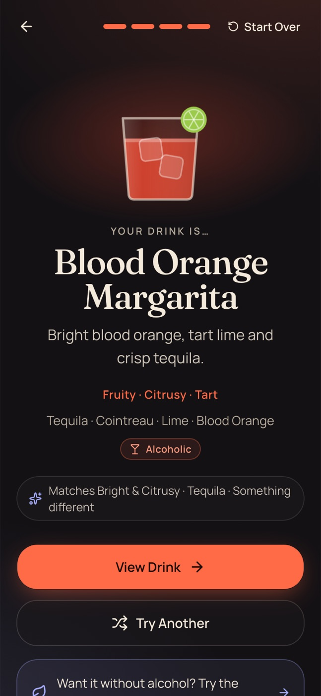
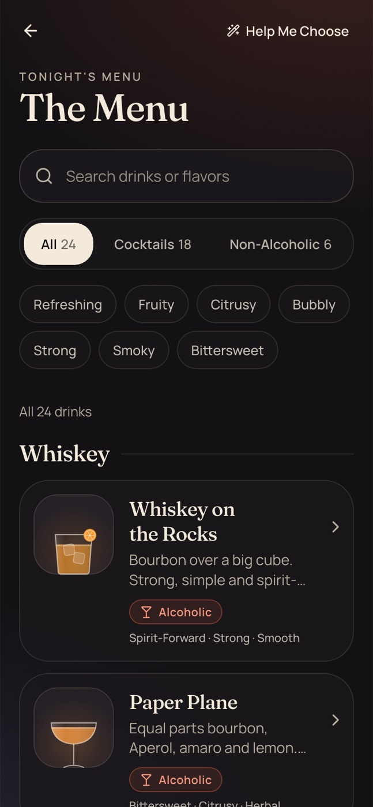
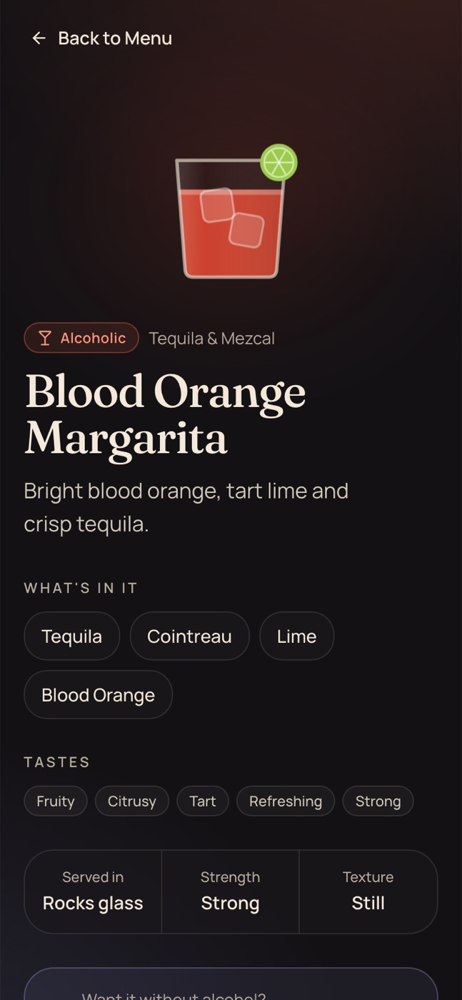
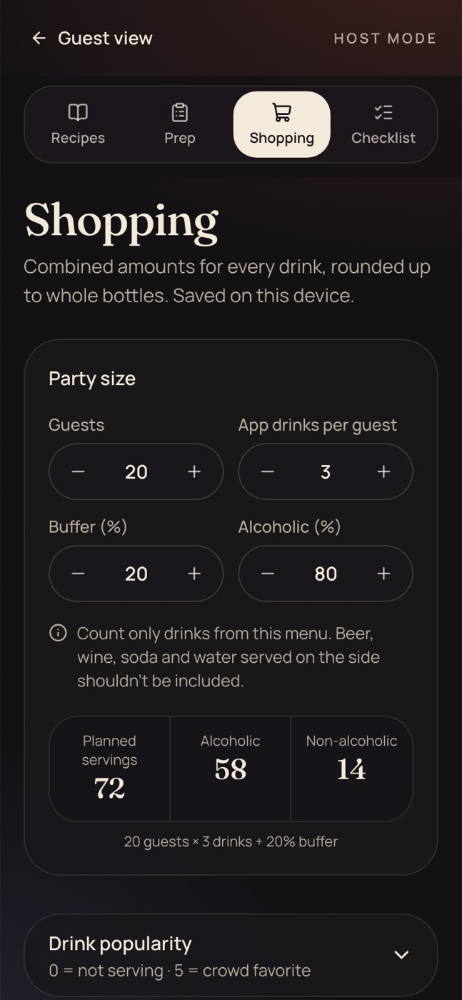

# Phase 1 Implementation Summary (for independent review)

Project: "Midnight Citrus", a party drink-discovery web app for Oct 4, 2026.
Spec: `phase-1.md/phase-1-specification-v1.1.md`. Stack: Next.js 16 (App Router), React 19, TypeScript, Tailwind v4, shadcn/ui (Radix), Vitest.
Status: built, linted, tested, production build passes. **Not committed, not deployed, not tested on real phones.**

## 1. What was implemented

| Route | Purpose |
|---|---|
| `/` | Two primary actions: Help Me Choose, I Know What I Want. Small Host link in footer. |
| `/find` | Guided finder: questions, one recommendation, Try Another, Change Answers, Start Over, Back, exhausted state. |
| `/menu` | All 24 drinks by spirit section. Search, All/Cocktails/Non-Alcoholic, 7 quick filters, empty state. |
| `/drink/[id]` | Details (static, 24 pages): ingredients, tags, glass, strength, NA alternative, back link. |
| `/host/recipes`, `/prep`, `/shopping`, `/checklist` | Host Mode. `/host` redirects to recipes. No auth, `noindex`. |
| `/not-found`, `icon.svg`, `apple-icon`, `manifest` | Polish items. |

All 24 drinks (18 alcoholic, 6 NA), exact spec recipes, and the 15 intentional NA pairings are in data. Everything is client/static; no API, DB, or auth.

## 2. Architecture and key decisions

- **Data separate from UI.** `data/drinks.ts`, `ingredients.ts`, `shopping-config.ts`, `prep.ts` are the only sources. Recipes reference stable ingredient IDs; drink IDs are stable kebab-case (used in URLs).
- **Pure logic in `lib/`** (no React): `recommendation.ts`, `finder-state.ts` (reducer), `search.ts`, `shopping.ts`, `finder-paths.ts` (enumerates all decision paths for tests/QA).
- **Recommender returns only a `drinkId`** (`Resolution` = question | recommendation | exhausted), keeping ordering out of scope for later.
- **State:** `useReducer` + `sessionStorage` for finder and menu filters; `localStorage` for host shopping inputs and checklist. No state library. A `useHydrated` (`useSyncExternalStore`) gate avoids hydration mismatches. Storage reads are guarded and saved state is re-validated on restore.
- **Static rendering:** every route prerendered (`generateStaticParams`, `dynamicParams = false` for drinks).
- **Visuals:** dark-only "Midnight Citrus Social Club" theme (charcoal, cream, coral, periwinkle), Manrope + Fraunces via `next/font`. Drinks are illustrated by a custom SVG glass component (shape, color, ice, bubbles, garnish) driven by data, so no photos.

## 3. Recommendation logic

1. Alcohol choice is a hard filter, always asked first.
2. Main flavor (6 options; "Bold & Strong" hidden for NA) scores each drink from `flavorTags` via `FLAVOR_TAG_WEIGHTS`, plus a small `tasteProfile` nudge.
3. Drinks scoring below 40% of the best flavor score are not "good matches" and are never shown.
4. If 2+ candidates are within `TIE_MARGIN` (1 point) of the leader, ask the follow-up question that minimizes expected remaining candidates (spirit, carbonation, strength, style, clean/smoky). Options offered are only those leading to a good match. Max 2 follow-ups. Final tie-break: `recommendationPriority`, then id.
5. Try Another: keeps answers, excludes shown drinks, asks no new questions. When no good matches remain:
   - **Cocktails:** "You've seen the best matches for those choices." with Change an Answer / Start Over / Browse Full Menu (per spec).
   - **Non-alcoholic:** continues through the remaining NA drinks in rank order, each labelled "A little different" with a short note, until all 6 are seen; then "You've seen every non-alcoholic drink." (Added after manual QA, section G.)
6. Pick history: Back on a result steps to earlier picks (also a "Previous pick · Pick 2 of 3 · Next pick" switcher); past picks on the end screen reopen in the finder. Try Another from an earlier pick still adds a new unseen drink.
7. Changing an earlier answer truncates later answers and picks; re-picking the same answer keeps them. Back steps through questions; stepping back onto the first question (or leaving home from it) resets the whole session.

Tested over all 34 enumerated paths: each yields exactly one valid drink, no repeats across Try Another, every drink reachable, every NA path reaches all 6 NA drinks with closest matches first. Path lengths: 6 take 2 questions, 19 take 3, 9 take 4.

## 4. Responsive behavior

Mobile-first, checked in headless Chrome at 320/375/390/430/768/1280 px: no horizontal overflow on any route. Cards shrink swatches below 380 px; segmented filters size to content; menu goes to 2 columns at `md`; host pages cap at `max-w-3xl`, finder at `max-w-xl`. Safe-area insets and `dvh` are used. Desktop keeps the same simple layout.

## 5. Accessibility work

Semantic landmarks and headings; focus moves to the new step's `h1` on each transition; option buttons use `aria-pressed` with a visible check plus screen-reader text; badges are text + icon (never color alone); labelled search and steppers; `aria-live` result counts; checklist uses real checkboxes; `:focus-visible` rings; global `prefers-reduced-motion` override; buttons 44-56 px tall; 16px+ body text. Keyboard flow verified (tab to option, Enter advances).
**Not done:** no axe/Lighthouse audit, no numeric contrast measurement, no screen-reader test (VoiceOver/TalkBack).

## 6. Files

- **Data/types:** `data/{drinks,ingredients,shopping-config,prep}.ts`, `types/{drink,ingredient,recommendation}.ts`
- **Logic:** `lib/{recommendation,finder-state,finder-paths,search,shopping,labels,drink-display,storage,utils}.ts`, `hooks/use-hydrated.ts`
- **Finder:** `components/finder/{finder,question-step,result-view,exhausted-view,option-icons}`
- **Menu/drinks:** `components/menu/menu.tsx`, `components/drinks/{drink-card,drink-swatch,glass-illustration,alcohol-badge,flavor-tags,back-link}`
- **Host:** `components/host/{host-nav,page-heading,recipe-card,recipe-browser,stepper,shopping-calculator,checklist}`
- **Shared/UI:** `components/shared/top-bar.tsx`, `components/ui/button.tsx` (shadcn, resized for 44-56 px targets)
- **App:** `app/{layout,page,globals.css,not-found,manifest,icon.svg,apple-icon}`, `app/find`, `app/menu`, `app/drink/[id]`, `app/host/**`
- **Tests (102):** `tests/{data,recommendation,finder-state,search,shopping,finder-paths}.test.ts`; `vitest.config.mts`
- **Docs:** `README.md`, this file

## 7. Deviations from the spec

1. **Gin Collins NA alternative:** spec says "Ginger Lime Fizz or Lemonade"; schema holds one `naAlternativeId`, so only Ginger Lime Fizz.
2. **French 75 name:** displayed as "French 75", not "French 75 — Prosecco Party Version".
3. **Schema additions:** `beverageType`, `menuSection`, `glass`, `color` on drinks; `guestName` on ingredients. Spec lists `aperitif` nowhere under base spirits; added it for Aperol Spritz (NA drinks use `none`).
4. **Whiskey on the Rocks:** ice is not a recipe line. Ice is computed per planned serving in shopping (0.5 lb default).
5. **Follow-up cap:** up to 4 total questions on 9 of 34 paths; spec says "most guests 2-3" (25 of 34 paths meet that).
6. **"Clean or smoky?"** is implemented and unit-tested with synthetic data, but with the real menu no tie currently triggers it (the spirit question resolves tequila vs mezcal first).
7. **Extras beyond spec:** an on-hand "Have" input producing a Buy list; PWA manifest/icons; "Why this drink" chip; answer trail for editing; app name "Midnight Citrus" (invented).
8. **Search alias:** "virgin margarita" on Blood Orange Limeade means it appears in "margarita" searches (intentional, tested).
9. **Dependencies:** added Vitest (dev only). shadcn init installed the `cn` package rather than clsx/tailwind-merge; only the Button component is used (unused shadcn components removed).
10. **Host link** is in the home footer (spec's screen map shows Host at top level; no dedicated entry on guest screens otherwise).
11. **Non-alcoholic Try Another** continues past the good matches to all 6 NA drinks instead of showing the spec's "You've seen the best matches" message (cocktails still follow the spec). Requested after manual QA.

## 8. Known limitations and unverified items

- **Not tested** on iPhone Safari or any real device; only headless Chrome.
- **Authored content to review:** drink descriptions, method steps, glass, garnish, taste scores, tag assignments, and demand weights were written by the implementer (spec gave names, short taglines, recipes only). Quantities like juice per fruit (lemon 1 oz, lime 0.75 oz), garnish yields, syrup/juice package sizes, and ice rate are estimates.
- Recommendation quality is judged only by inspecting enumerated paths, not by user testing.
- Host data is per-device (localStorage); no sync. Fraunces/Manrope are fetched at build time from Google Fonts.
- Dark theme only; no light mode.
- Shopping inputs default to 20 guests × 3 drinks; the real party values are still unknown (spec's open questions 1-5 remain: guest count, drinks per guest, split, owned inventory, outside drinks).

## 9. Intentionally deferred (per spec)

Ordering, guest names, queue/status, tablet screen, inventory and ingredient availability, customization, accounts/host login, cloud sync, payments, coffee/tea, multi-household. Data model leaves room: stable ingredient IDs, extensible `beverageType`, recommender returning only a `drinkId`.

## 10. Screenshots

Captured from the production build in headless Chrome: phone shots at 390×844 (2x), desktop at 1280×860. Files are in `docs/screenshots/`.

| Screen | File |
|---|---|
| Home | `01-home.jpg` |
| Finder: alcohol question | `02-question-alcohol.jpg` |
| Finder: flavor question | `03-question-flavor.jpg` |
| Finder: spirit follow-up (tie-break) | `04-question-spirit.jpg` |
| Finder: style follow-up (second tie-break) | `05-question-tiebreak.jpg` |
| Finder: recommendation | `06-result.jpg` |
| Finder: recommendation actions and NA alternative | `07-result-actions.jpg` |
| Finder: Try Another | `08-try-another.jpg` |
| Finder: exhausted state | `09-exhausted.jpg` |
| Menu | `10-menu.jpg` |
| Menu: search "ginger" | `11-menu-search.jpg` |
| Menu: NA + Bubbly filters | `12-menu-filters.jpg` |
| Menu: empty state | `13-menu-empty.jpg` |
| Drink details | `14-drink-detail.jpg` |
| Host: recipes | `15-host-recipes.jpg` |
| Host: prep | `16-host-prep.jpg` |
| Host: shopping inputs | `17-host-shopping.jpg` |
| Host: shopping list | `18-host-shopping-list.jpg` |
| Host: checklist | `19-host-checklist.jpg` |
| Desktop menu | `20-desktop-menu.jpg` |
| Desktop home | `21-desktop-home.jpg` |

